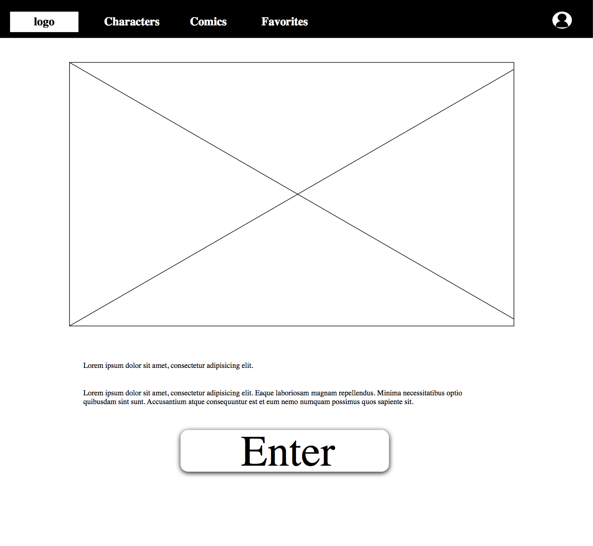
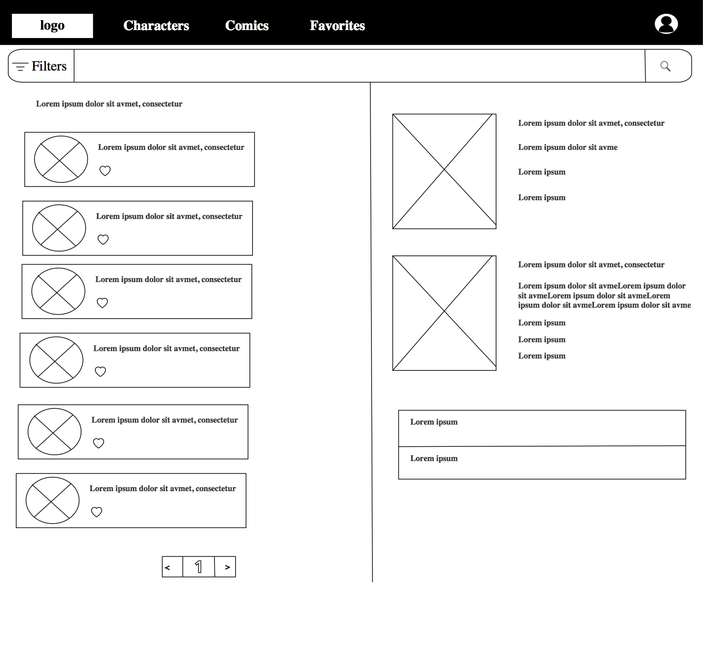
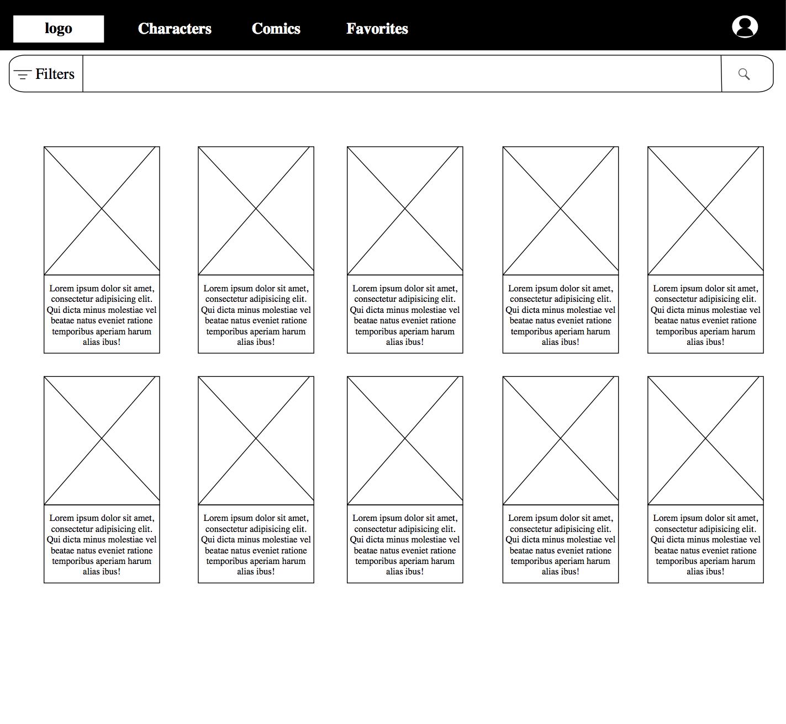
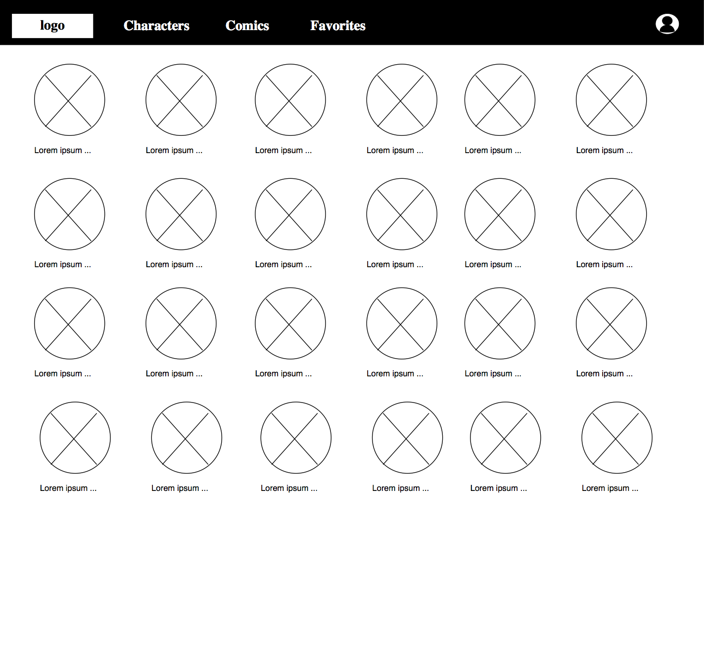

# Marvel API 
___

 Live version: https://marvelapi-1afdc.web.app

## Overview 
This app was created as a school project for perscholas

## Features
Firebase backend 
- Authentication to sign in users
- Database to store user information 
- Pagination to search api database
- Filtering options 
- Favorites list to store liked characters
- Responsive website with bootstrap

## Dependencies
- axios
- bootstrap: 5.1.3
- firebase: 9.6.6
- react": 17.0.2
- react-dom": 17.0.2
- react-router-dom: 6.2.1
- react-scripts": 5.0.0
   

## Future addons 
- Ranking for most liked Characters and Comics 
- Profile Picture
- Adding comics to favorite list 
- Recommendations depending on your liked Characters and Comics 
- Movies Section

## WireFrame
Home Page

Characters Page

Comics page

Favorites page

